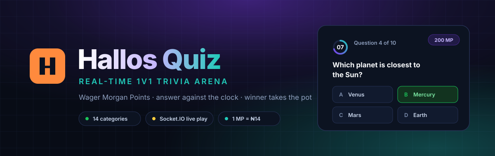
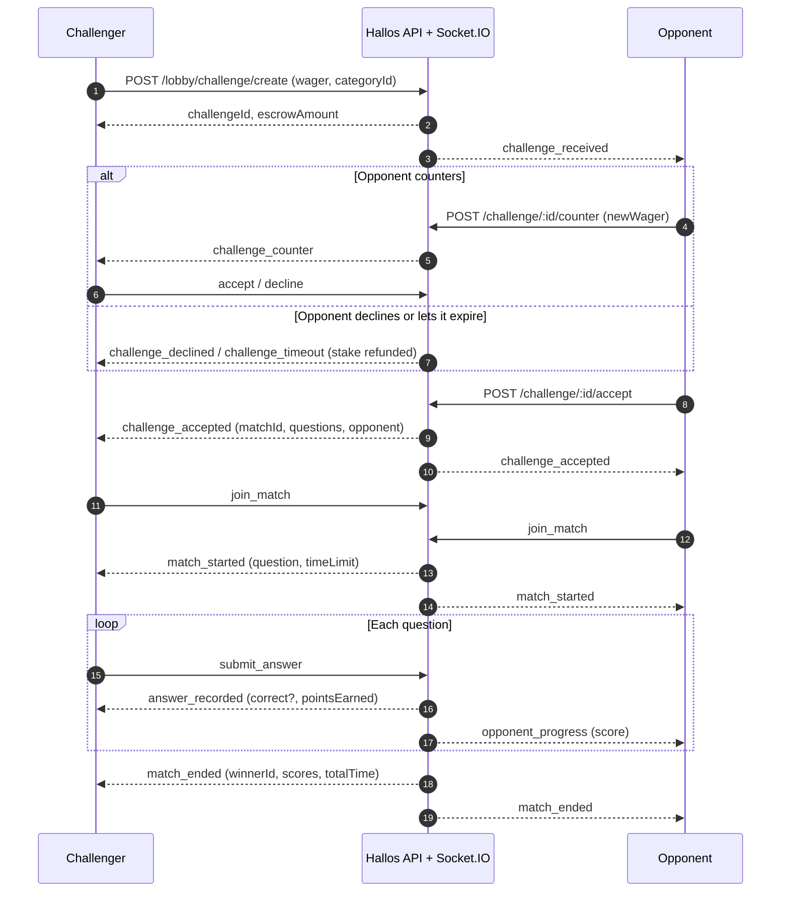
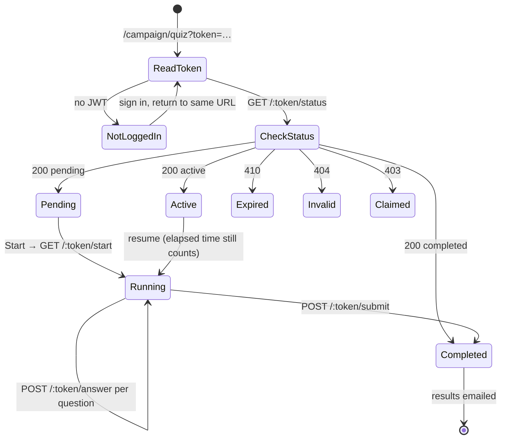
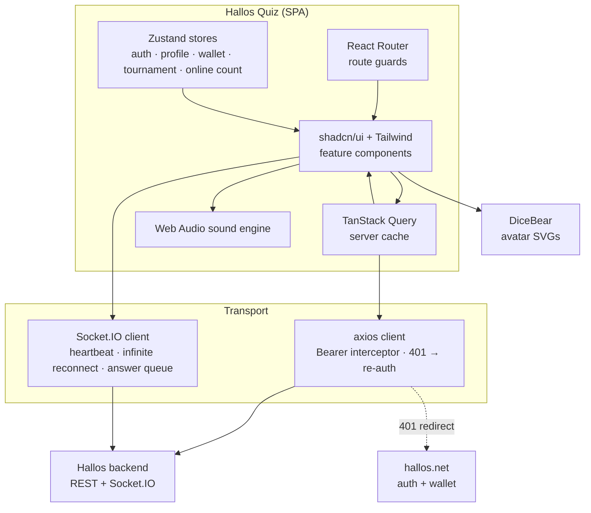

<div align="center">



<br />

**A real-time, wager-based 1v1 trivia arena for the [Hallos](https://www.hallos.net) platform.**

Challenge players who are online right now, stake Morgan Points on the outcome, answer
against a live countdown, and watch your opponent's score move in real time.

<br />

[](https://react.dev)
[](https://www.typescriptlang.org)
[](https://vitejs.dev)
[](https://tailwindcss.com)
[](https://socket.io)
[](https://vitest.dev)

</div>

---

## Table of contents

- [What it is](#what-it-is)
- [Features](#features)
- [How a match works](#how-a-match-works)
- [Campaign quiz](#campaign-quiz)
- [Architecture](#architecture)
- [Tech stack](#tech-stack)
- [Getting started](#getting-started)
- [Environment variables](#environment-variables)
- [Routes](#routes)
- [Backend API surface](#backend-api-surface)
- [Real-time events](#real-time-events)
- [The Morgan Point economy](#the-morgan-point-economy)
- [Project structure](#project-structure)
- [Testing](#testing)
- [Deployment](#deployment)
- [Screenshots](#screenshots)

---

## What it is

Hallos Quiz is the trivia game surface of the Hallos platform. It is a **single-page React
app** that runs alongside the main Hallos product: users arrive already authenticated,
their JWT is handed over through the URL, and every gameplay action is brokered over a
persistent Socket.IO connection to the Hallos backend.

The app ships two distinct game modes from one codebase:

| Mode | Route | Shape |
|---|---|---|
| **Arena** — head-to-head wagered matches | `/lobby` → `/game` | Live, socket-driven, opponent-aware |
| **Campaign quiz** — email-invited scored assessment | `/campaign/quiz?token=…` | Solo, 20 questions, REST-driven, token-gated |

---

## Features

### ⚔️ Live 1v1 challenge arena

The lobby is a real-time roster of everyone currently online. Pick an opponent, choose a
category, name your wager, and send it. The full negotiation happens over sockets:

- **Direct challenges** — target a specific player from the online list
- **Open challenge board** — post a challenge to the room and let anyone accept
- **Counter-offers** — an opponent can push back with a different wager before accepting
- **Escrow on create** — the stake is locked when the challenge is sent, refunded on
  decline, timeout, or cancel
- **Expiry & timeout handling** — challenges auto-expire, with modal states for every
  branch (`waiting`, `timeout`, `rejected`, `accepted`, `counter`)
- **Live online count**, pushed via `players_updated` rather than polled

### 🎮 Real-time gameplay

Once a challenge is accepted, both players drop into a synchronised match.

- **Per-question countdown** with escalating audio cues as time runs out
- **Opponent progress feed** — you see their score climb live via `opponent_progress`
- **Bonus questions** worth extra points
- **Reconnection-safe** — infinite reconnect attempts, a 30s heartbeat, and
  `match_state_restored` to rejoin a match in progress after a refresh or dropout
- **Offline answer queue with REST fallback** — if the socket is down when you answer,
  the answer is queued locally and re-sent over HTTP after 5s, then re-queued if that
  also fails. No answer is silently lost.
- **Forfeit flow** with confirmation, and a 10s "match didn't start" bailout back to the lobby

### 📊 Results & sharing

- Score card with correct/incorrect breakdown and per-question response times
- Payout summary — pot, commission, net
- **Shareable result image** rendered client-side with `html2canvas`

### 🏆 Leaderboards

Three independently paginated boards, each with skeleton loading and rank badges:

| Board | What it ranks |
|---|---|
| **Global** | All-time points across the whole platform |
| **Lobby** | 1v1 arena performance |
| **Tournament** | Standings within scheduled events |

### 🎪 Tournaments

Scheduled, multi-round events with an arena view, detail view, per-tournament
leaderboard, history, and a hosting flow.

> **Note:** tournaments are currently behind a feature flag. Flip
> `IS_TOURNAMENT_LOCKED` in [src/pages/Tournament.tsx](src/pages/Tournament.tsx) to
> `false` to enable them — until then, entry points open a "coming soon" lock modal.

### 💰 Morgan Wallet

A full in-app currency wallet, backed by the user's real Hallos balance:

- **Balance** — live Morgan Point balance with earned/spent totals
- **Purchase** — buy MP from your Hallos wallet, in preset packages or a custom amount
  (minimum 100 MP), with NGN and USD display
- **Withdraw** — cash MP back out to your Hallos wallet (10% fee, minimum 1,000 MP)
- **History** — paginated ledger, every entry typed and labelled: welcome bonus, purchase,
  withdrawal, match wager, match win, match refund, tournament entry, tournament prize,
  tournament refund

### 🧑‍🚀 Game identity

<div align="center">


</div>

Your arena persona is separate from your Hallos account:

- **Nickname** with live availability checking (3–30 chars, alphanumeric + underscore)
  and a **2-week change cooldown** enforced in the UI
- **Avatars** generated from [DiceBear](https://www.dicebear.com) across 7 styles —
  `avataaars`, `pixel-art`, `bottts`, `lorelei`, `micah`, `adventurer`, and more —
  seeded from your nickname
- **Profile stats** — wins, losses, points, rank

### 🧭 Onboarding & guide

- A 5-step onboarding carousel covering the arena, categories, wagering, and gameplay,
  with an exit-confirm guard
- An in-app **guide** rendered as an interactive 3D flip-book (`react-pageflip`) covering
  navigation, gameplay, buying MP, the ₦/MP peg, and how the winner-takes-pot economy works

### 🎨 Platform polish

- Dark-first design system built on **shadcn/ui** + Radix primitives, with a violet/teal
  palette defined entirely in CSS custom properties
- Mobile-first and fully responsive — collapsible sidebar, scrollable tab bars, touch targets
- **Web Audio sound engine** — synthesized clicks, correct/wrong stings, and a looping
  countdown bell, no audio files shipped
- Toast + sonner notification layers, skeleton loaders on every async surface

---

## How a match works



If the socket drops mid-match, `submit_answer` falls back to
`POST /api/quiz/lobby/match/:id/answer` after 5 seconds, and `match_state_restored`
rehydrates the match on reconnect.

---

## Campaign quiz

A separate, token-gated flow for email-invited assessment campaigns. Twenty questions,
15 seconds each, 300 seconds total, no retakes.



Every terminal state has a dedicated screen in
[src/components/campaign/](src/components/campaign/) — pending, loading, results,
expired, invalid, claimed, already-completed, not-logged-in, and generic error.
Full protocol notes live in [campaign.md](campaign.md).

---

## Architecture



**State ownership is deliberately split:**

- **TanStack Query** owns everything the server is the source of truth for — lobby
  players, challenges, leaderboards, transactions, tournaments, profile.
- **Zustand** owns client session state — the JWT (in `sessionStorage`, so it dies with
  the tab), the persisted quiz profile, live wallet balance updated optimistically by
  mutations, tournament view state, and the socket-pushed online count.
- **`sessionStorage`** holds match-scoped scratch state (`currentMatch`, `matchEnded`) so
  a refresh mid-match can recover.

Auth is delegated: this app never logs anyone in. It reads the token handed to it, and on
any `401` it clears the session and bounces the user back to
`hallos.net/dashboard/games`, whose auth guard round-trips them through sign-in.

---

## Tech stack

| Layer | Choice |
|---|---|
| Framework | React 18 + TypeScript 5.8 |
| Build | Vite 5 with SWC |
| Routing | React Router 6 |
| Server state | TanStack Query 5 |
| Client state | Zustand 5 |
| Real-time | Socket.IO client 4.8 |
| HTTP | axios (interceptor-based auth + 401 handling) |
| Styling | Tailwind CSS 3.4 + `tailwindcss-animate` |
| Components | shadcn/ui on Radix UI primitives |
| Icons | lucide-react |
| Forms | react-hook-form + zod |
| Charts | Recharts |
| Notifications | Radix Toast + Sonner |
| Image export | html2canvas |
| Testing | Vitest + Testing Library + jsdom |

---

## Getting started

**Prerequisites:** Node.js 18+ and npm.

```bash
# 1. Clone
git clone https://github.com/Gracious17/hallos-quiz.git
cd hallos-quiz

# 2. Install
npm install

# 3. Configure
cp .env.example .env.local
#    then edit .env.local — see below

# 4. Run
npm run dev
```

The dev server starts on **http://localhost:8080**.

### Scripts

| Command | What it does |
|---|---|
| `npm run dev` | Vite dev server with HMR on port 8080 |
| `npm run build` | Production build to `dist/` |
| `npm run build:dev` | Build with development mode settings |
| `npm run preview` | Serve the production build locally |
| `npm run lint` | ESLint across the repo |
| `npm test` | Run the Vitest suite once |
| `npm run test:watch` | Vitest in watch mode |

---

## Environment variables

| Variable | Required | Description |
|---|---|---|
| `VITE_API_URL` | ✅ | Base URL of the Hallos backend. Used for both the axios client and the Socket.IO connection. |
| `VITE_PARENT_APP_URL` | ✅ | The main Hallos app, e.g. `https://www.hallos.net`. Used for auth redirects and "back to platform" links. |

> **Auth note:** the app expects to be entered with a JWT supplied by the parent Hallos
> app. It is stored in `sessionStorage` under `auth_token` and attached as
> `Authorization: Bearer …` on every request and on the socket handshake. Running the app
> standalone gets you as far as onboarding; anything server-backed needs a real token.

---

## Routes

| Path | Page | Notes |
|---|---|---|
| `/` | Onboarding | Guest-only — registered users are redirected to `/lobby` |
| `/profile` | Profile setup | Guest-only |
| `/lobby` | Lobby | App shell · online players + challenge board |
| `/game` | Gameplay | Full-screen, no shell — intro → playing → results |
| `/tournament` | Tournament | App shell · currently feature-flagged off |
| `/leaderboard` | Leaderboard | App shell · global / lobby / tournament tabs |
| `/wallet` | Morgan Wallet | App shell · balance, purchase, withdraw, history |
| `/identity` | Game Identity | App shell · nickname + avatar |
| `/guide` | Guide | App shell · 3D flip-book walkthrough |
| `/campaign/quiz?token=…` | Campaign quiz | Standalone, token-gated |
| `*` | Not found | |

Routes under the app shell share the sidebar and top bar from
[src/components/layout/AppLayout.tsx](src/components/layout/AppLayout.tsx).

---

## Backend API surface

Every path below is consumed by a typed client in [src/lib/api/](src/lib/api/).

<details>
<summary><b>Profile</b> — <code>src/lib/api/quizProfile.ts</code></summary>

```
GET    /api/quiz/user/check-nickname?nickname=…
POST   /api/quiz/user/register
GET    /api/quiz/user/profile/:userId
PATCH  /api/quiz/user/profile
```
</details>

<details>
<summary><b>Lobby &amp; matches</b> — <code>src/lib/api/lobby.ts</code></summary>

```
GET    /api/quiz/categories
GET    /api/quiz/lobby/players?page&limit
GET    /api/quiz/lobby/challenges?status&page&limit
POST   /api/quiz/lobby/challenge/create
POST   /api/quiz/lobby/challenge/:id/accept
POST   /api/quiz/lobby/challenge/:id/decline
POST   /api/quiz/lobby/challenge/:id/counter
POST   /api/quiz/lobby/challenge/:id/cancel
GET    /api/quiz/lobby/active-match
GET    /api/quiz/lobby/match/:id
POST   /api/quiz/lobby/match/:id/answer     ← socket fallback
POST   /api/quiz/lobby/match/:id/forfeit
```
</details>

<details>
<summary><b>Wallet</b> — <code>src/lib/api/chutaWallet.ts</code></summary>

```
GET    /api/quiz/user/balance
GET    /api/quiz/user/transactions?page&limit
POST   /api/quiz/currency/purchase
POST   /api/quiz/currency/withdraw
GET    /api/wallet/balance?currency        ← parent Hallos wallet
```
</details>

<details>
<summary><b>Leaderboards</b> — <code>src/lib/api/leaderboard.ts</code></summary>

```
GET    /api/quiz/leaderboard/global?page&limit
GET    /api/quiz/leaderboard/lobby?page&limit
GET    /api/quiz/leaderboard/tournament?page&limit
GET    /api/quiz/active-users
```
</details>

<details>
<summary><b>Tournaments</b> — <code>src/lib/api/tournament.ts</code></summary>

```
GET    /api/quiz/tournaments?…
GET    /api/quiz/tournament/:id
POST   /api/quiz/tournament/:id/register
POST   /api/quiz/tournament/:id/unregister
```
</details>

<details>
<summary><b>Campaign quiz</b> — <code>src/lib/api/campaignQuiz.ts</code></summary>

```
GET    /api/campaigns/quiz/:token/status
GET    /api/campaigns/quiz/:token/start
POST   /api/campaigns/quiz/:token/answer
POST   /api/campaigns/quiz/:token/submit
```
</details>

---

## Real-time events

Defined in [src/lib/socket/events.ts](src/lib/socket/events.ts) and
[src/lib/socket/emitters.ts](src/lib/socket/emitters.ts).

**Emitted by the client**

| Event | Payload |
|---|---|
| `join_match` | `{ matchId }` |
| `submit_answer` | `{ matchId, questionId, answer, timeInSeconds }` |
| `get_online_players` | `{ page, limit }` |
| `heartbeat` | `{ timestamp }` — every 30s |

**Received from the server**

| Event | Meaning |
|---|---|
| `players_updated` | Online player count changed |
| `challenge_received` | Someone challenged you |
| `challenge_accepted` | Match created — carries `matchId`, questions, opponent |
| `challenge_declined` | Declined — carries `refundAmount` |
| `challenge_timeout` | Challenge expired unanswered |
| `challenge_counter` | Opponent proposed a different wager |
| `match_started` | First question + time limit |
| `answer_recorded` | Your answer's result and points |
| `opponent_progress` | Opponent's live score |
| `match_ended` | Winner, both scores, total time |
| `match_state_restored` | Rejoin an in-progress match after reconnect |

**Connection policy:** websocket transport only, infinite reconnection attempts, 2s
initial delay backing off to 10s max, 30s application-level heartbeat (server timeout is
120s), and a connection-change listener the UI subscribes to for offline indicators.

---

## The Morgan Point economy

**Morgan Points (MP)** are the in-app currency for every wager, entry fee, and payout.

| Rule | Value |
|---|---|
| Peg | 1 MP = **₦14** |
| Minimum purchase | 100 MP (₦1,400) |
| Minimum withdrawal | 1,000 MP |
| Withdrawal fee | 10% |
| Match economics | Both players stake the wager; winner takes the pot less house commission |

Purchase packages: 100 MP (₦1,400) · 357 MP (₦5,000) · 714 MP (₦10,000) ·
1,785 MP (₦25,000) · 3,571 MP (₦50,000) — plus a custom amount field.

**Categories:** General Knowledge, Logical Reasoning, Maths, Arts, Economics,
Current Affairs, History, Science, Sports, Programming, Riddles, Finance, Politics,
Business.

---

## Project structure

```
src/
├── pages/                    # One file per route
│   ├── Onboarding.tsx        #   5-step intro carousel
│   ├── ProfileSetup.tsx      #   nickname + avatar registration
│   ├── Lobby.tsx             #   online players + challenge board + modals
│   ├── Gameplay.tsx          #   intro → playing → results state machine
│   ├── Tournament.tsx        #   view switcher (arena/detail/leaderboard/history/host)
│   ├── Leaderboard.tsx       #   global / lobby / tournament tabs
│   ├── ChutaWallet.tsx       #   balance / purchase / withdraw / history tabs
│   ├── Identity.tsx          #   nickname + avatar editing with cooldown
│   ├── Guide.tsx             #   3D flip-book walkthrough
│   └── CampaignQuiz.tsx      #   token-gated 20-question assessment
│
├── components/
│   ├── layout/               # AppLayout, Sidebar, TopBar
│   ├── lobby/                # player cards, challenge board
│   ├── challenge/            # category tags, wager badge, player-vs card
│   ├── gameplay/             # question card, answer options, header, intro
│   ├── results/              # score card, breakdown, share modal
│   ├── modals/               # challenge, status, incoming, forfeit, exit
│   ├── leaderboard/          # per-tab tables + rank badges
│   ├── tournament/           # arena, detail, history, host, lock modal
│   ├── wallet/               # balance, purchase, withdraw, history tabs
│   ├── identity/             # nickname input, avatar pickers, stats
│   ├── campaign/             # every campaign-quiz terminal screen
│   ├── onboarding/           # slides, feature cards, category badges
│   └── ui/                   # shadcn/ui primitives
│
├── lib/
│   ├── api/                  # typed axios clients, one per domain
│   ├── socket/               # socket lifecycle, emitters, typed events
│   ├── helpers/              # response parsing
│   └── soundEngine.ts        # Web Audio synthesis, no audio assets
│
├── hooks/                    # TanStack Query hooks per domain
├── store/                    # Zustand stores
├── data/                     # static game/wallet/tournament data
└── assets/                   # logo, avatars, backgrounds
```

---

## Testing

```bash
npm test           # single run
npm run test:watch # watch mode
```

Vitest with jsdom and Testing Library; global setup lives in
[src/test/setup.ts](src/test/setup.ts).

---

## Deployment

The app is a static SPA — build with `npm run build` and serve `dist/`. Every host needs
a catch-all rewrite to `index.html` so client-side routes resolve on hard refresh. Configs
for three hosts are already committed:

| Host | Config |
|---|---|
| Netlify | [netlify.toml](netlify.toml) + [public/_redirects](public/_redirects) |
| Vercel | [vercel.json](vercel.json) |
| AWS Amplify | [amplify.yml](amplify.yml) |

Set `VITE_API_URL` and `VITE_PARENT_APP_URL` in the host's environment before building —
Vite inlines them at build time, so they cannot be changed after the fact without a rebuild.

---

## Screenshots

Captures live in [docs/screenshots/](docs/screenshots/) — see the
[naming guide](docs/screenshots/README.md) there for the recommended set. Drop your PNGs
in and reference them here.

---

<div align="center">


Built for the [Hallos](https://www.hallos.net) platform.

</div>
